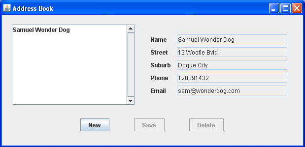

CAB302 Software Development
===========================

# Week 8: Data Connectivity - JDBC

The classes for this week are about the use of JDBC in a fairly simple application which talks to a MariaDB backend 
database. Note that there may be individual differences between these instructions and your experience based on how you have installed MariaDB-- adjust settings accordingly.

## Preparation - Getting started with MariaDB

First, if you have not done so already, you will need to install MariaDB. Instructions for doing so are on Blackboard under Learning Resources -> Guides and Other Resources.

Note the file 'db.props' in both the lecture examples and this repository. It contains the username and password for the
database. We have set this up with a username of "root" and a password of "", which is fine with the default MariaDB configuration, but will need to be changed if you specified a root password. Note that in a production database you would create a specific user with restricted credentials and use that instead.

You will also need to run names.sql, which is available on Blackboard. The instructions for MariaDB will also describe how to do this.

Install the MariaDB JDBC driver in any IntelliJ project by opening Project Structure -> Libraries -> New Project Library (+ button) -> From Maven -> Search for `org.mariadb.jdbc:mariadb-java-client` and install the latest version.
Alternatively, the MySQL JDBC driver (MySQL Connector/J) is available from [http://dev.mysql.com/downloads/connector/](http://dev.mysql.com/downloads/connector/), along with connectors for 
other programming languages.

## Exercise – Getting started with the Lecture Examples

Consider running the lecture exercises (available from Blackboard) prior to undertaking the more 
advanced `AddressBook` example to ensure that the connection is set up and operating correctly. Make sure they 
compile and run. The MySQL JDBC driver has also been bundled with the lecture material project, and included as a dependency in IntelliJ.

This driver has been altered so that there is no need to use `Class.forName("...` to load the Driver class, although 
this is used in a number of the source files.

Information about the location of the database, the port to connect to and the username and password to use are stored in `db.props` and read by the `DBConnection` class. This should only require changing if you have different username/password requirements.

## Exercise – The JDBC AddressBook

Make sure you have the MariaDB JDBC driver prepared for this project as well as a MariaDB server running.

This code in this repository provides a simple Address Book application used in an earlier Java course by Mal Corney. 
In that environment, it was made to talk to a number of different data sources. Here we shall hook it up to a MariaDB
database via the usual JDBC connectivity. Note that we shall assume the same account as described above.

The application itself is as shown, a simple database which holds address details. What follows is a step by step 
approach to entering the relevant code. To help you understand the architecture, `AddressBook` is a simple main class 
which hosts the `AddressBookUI`, which constructs and manages the GUI, utilising the external database via a 
connection obtained via the `DBConnection` class. The individual record is defined by the `Person` class, and the 
remaining classes and interface are concerned with the data source and its management.

The abstraction used by the `AddressBook` application to interact with an external data source is defined in the 
`AddressBookDataSource` interface, and `JDBCAddressBookDataSource` is the JDBC oriented implementation of this 
interface, and thus contains the majority of the SQL code for this exercise. Finally, we note that the `AddressBookData` 
class is a list based structure to allow the application to work consistently with the data, essentially defining a 
collection of persons to be managed and displayed as appropriate.

Data entered through the GUI is to be saved in a MySQL table named `address` in a database named `cab302`. The 
application will need to create the table file if it does not already exist. SQL statements have been provided for 
this purpose, and this should be straightforward.

Implementation of the JDBC-based data source is based on the `AddressBookDataSource` interface but uses JDBC constructs 
to implement this functionality.

For simplicity the address data fields (name, street, suburb, phone and email) are all stored as Strings/VARCHAR.

***You will need to have the Java API open and be looking at the `java.sql` packages for this exercise. Instructions 
regarding which exceptions to catch have been left out. Detailed instructions for the completion of the exercise are 
as follows. Code positions are clearly marked in the relevant source files.***

**The `JDBCAddressBookDataSource` class:**

  - Constructor
    - Set up the `PreparedStatement` objects for the SQL queries to be used.
  - `addPerson()`
    - Use the `setString(int, String)` method to set values into each of the place holders for the `addPerson` 
      `PreparedStatement`.
    - Execute the statement.
  - `nameSet()`
    - Execute the `getNameList` statement.
    - Loop through the `ResultSet` and add each  name retrieved to the `Set`.
  - `getPerson()`
    - Set the place holder for the `name` parameter.
    - Execute the query and assign the returned `ResultSet` to `rs`.
    - Use the `ResultSet.first()` method to place the cursor on the first row of the `ResultSet`.
    - Extract the data from the columns and use the setter methods in `Person` to receive the data.
  - `getSize()`
    - Execute the rowCount statement.
    - Use the `ResultSet first()` method to place the cursor and retrieve the number of rows as an `int`.
  - `deletePerson()`
    - Set the name parameter into the statement and execute the update query.
  - `close()`
    - Close the `connection`.

**The `AddressBookData` class:**

The `JDBCAddressBookDataSource` class should now be able to be integrated with the Address Book application by adding 
an instance variable of type `AddressBookDataSource` and instantiating `JDBCAddressBookDataSource` – with these 
actions to take place in the constructor. The remainder of the class is unchanged.
